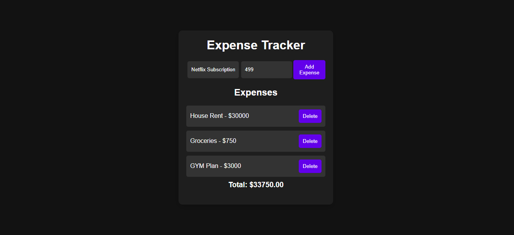

# Expense Tracker

A simple expense tracker built using HTML, CSS, and JavaScript. It allows users to add and delete expenses while keeping track of the total amount spent.

## Features

- Add new expenses
- Delete expenses
- Calculate total expenses
- Expenses remain saved after refreshing the page
- Dark-themed interface

## Technologies Used

- HTML
- CSS
- JavaScript
- Local Storage

## Screenshot



## Live Demo

[View Live Demo](https://anushka-kamble04.github.io/expense-tracker/)

## How to Run

1. Clone the repository:

   ```bash
   git clone https://github.com/Anushka-Kamble04/expense-tracker.git
   ```
2. Open the project folder.
3. Open `index.html` in your browser.
